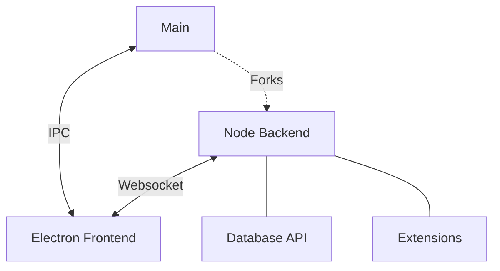
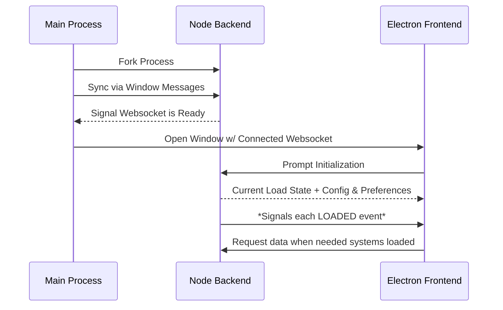

# Architecture

## Overview

```mermaid
flowchart TD
    Main-.Forks.->Backend[Node Backend]
    Main<--IPC-->Front[Electron Frontend]
    Backend<--Websocket-->Front
    Backend---Database[Database API]
    Backend---Extensions
```

## Startup Procedure

```mermaid
sequenceDiagram
    Main Process->>Node Backend: Fork Process
    Main Process->>Node Backend: Sync via Window Messages
    Node Backend-->>Main Process: Signal Websocket is Ready
    Main Process->>Electron Frontend: Open Window w/ Connected Websocket
    Electron Frontend->>Node Backend: Prompt Initialization
    Node Backend-->>Electron Frontend: Current Load State + Config & Preferences
    Node Backend->>Electron Frontend: *Signals each LOADED event*
    Electron Frontend->>Node Backend: Request data when needed systems loaded
```