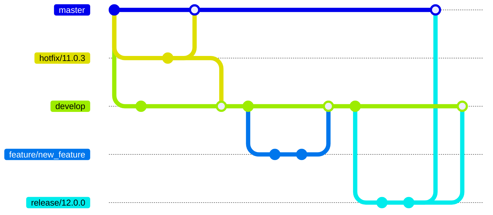
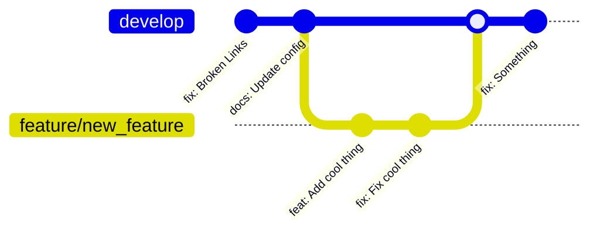
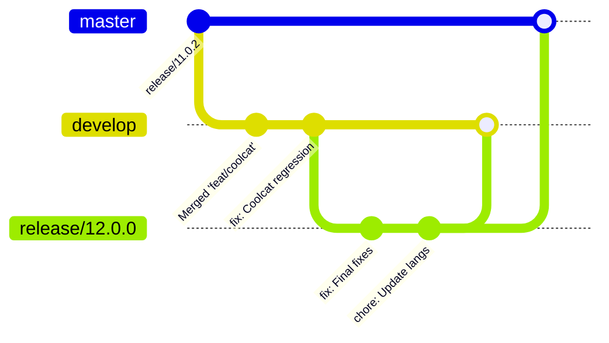
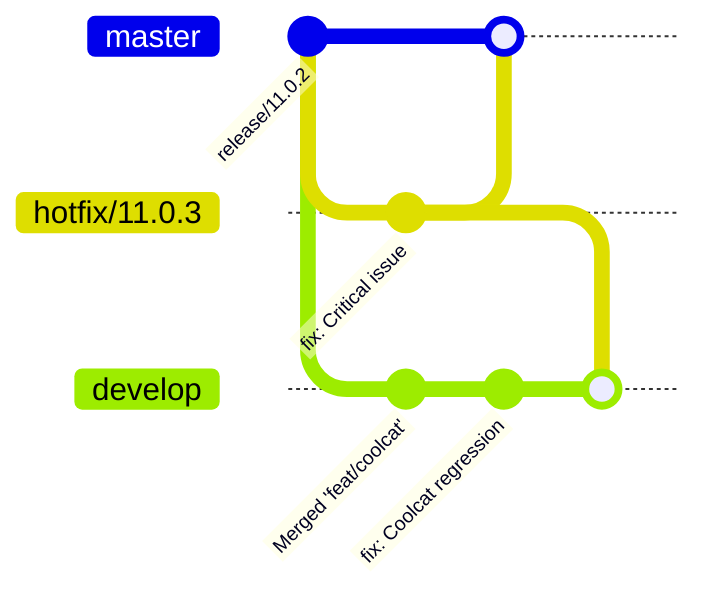

# Git Workflow

The workflow for the Flashpoint Launcher is loosely built around Gitflow. You can find a more detailed writeup for how this works from [Gitkraken](https://www.gitkraken.com/learn/git/git-flow).

This page will outline the basic principles. Try not to get too overwhelmed, just focus on the parts relevant to what you're doing.

Please see [Making a pull request](#making-a-pull-request) when you need to push your changes remotely.

## Branches

- `master` - Current release / stable branch
- `develop` - Main development branch
- `feature/**` - Feature branches - **Branches off develop** - *Merges into develop*
- `release/**` - Release branches - **Branches off develop** - *Merges into develop and master*
  - Used to introduce new functionality or breaking changes to stable
- `hotfix/**` - Hotfix branches - **Branches off master** - *Merges into develop and master*
  - Used to introduce fixes to stable, without including new `develop` branch changes



## Making a pull request

To push your changes, you will first need to create a fork if you don't have write access to the origin repository. You can do this via the [Launcher GitHub](https://github.com/FlashpointProject/launcher) page.

Next, add your fork as a new remote:
```
git remote add myfork <url/to/fork>
```

You can now push your new branch to track your fork, for example
```
git push --set-upstream myfork feature/new_feature
```

Finally, you can open the pull request through the [Launcher GitHub](https://github.com/FlashpointProject/launcher) page.

## Adding new features



Checkout `develop` branch and then create a new feature branch
```bash
git checkout develop
git pull
git checkout -b feature/new_feature
```

Commit changes to this new branch.

When ready, open a pull request targeting `develop`.

When ready to merge into `develop`, do this via GitHub.

## Releasing a new version (release branch)



Use a release branch when needing to introduce new functionality or breaking changes to the stable branch. It is recommended to freeze new feature additions after creating your release branch and spend the bulk of your time here doing testing.

Checkout `develop` branch and then create a new release branch
```bash
git checkout develop
git pull
git checkout -b release/12.0.0
```

Commit any needed changes to this new branch.

When ready, open a pull request targeting `master`. **Do not merge this via github.**.

When ready to merge, manually merge into both `master` and `develop`.

## Releasing a new version (hotfix branch)



Use a hotfix branch when needing to apply bugfixes without introducing the instability / changes from the develop branch.

Checkout `develop` branch and then create a new hotfix branch
```bash
git checkout master
git pull
git checkout -b hotfix/12.0.1
```

Commit any needed changes to this new branch.

When ready, open a pull request targeting `master`. **Do not merge this via github.**.

When ready to merge, manually merge into both `master` and `develop`.

